# Problem Statement 1: Print "Hello, World!"

## Problem Idea
Print the exact string `"Hello, World!"` to the output.

---

## Explanation
This is a simple introductory problem that requires printing a predefined string. The program has no input and no logic—just a direct output statement.

---

## Step-by-Step Algorithm
1. Start.
2. Print the string `"Hello, World!"`.
3. End.

---

## Flowchart

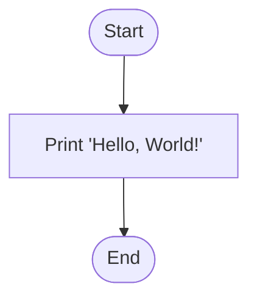

---

## Time and Space Complexity
- Time Complexity: `O(1)`
- Space Complexity: `O(1)`

---

# Problem Statement 35: Calendar Module (Find Day)

## Problem Idea
Given a date in `MM DD YYYY` format, print the day of the week in uppercase.

---

## Explanation
The solution uses Python's `calendar` module:
- `calendar.weekday(year, month, day)` returns an index from `0` (Monday) to `6` (Sunday).
- `calendar.day_name[index]` gives the day name.
- `.upper()` converts it to the required format.

---

## Step-by-Step Algorithm
1. Start.
2. Read `M`, `D`, `Y`.
3. Compute `weekday = calendar.weekday(Y, M, D)`.
4. Fetch day string using `calendar.day_name[weekday]`.
5. Convert to uppercase and print.
6. End.

---

## Flowchart

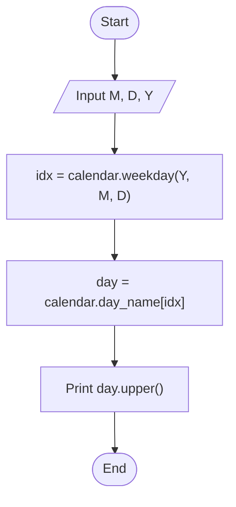

---

## Time and Space Complexity
- Time Complexity: `O(1)`
- Space Complexity: `O(1)`

---

# Problem Statement 36: Polynomials

## Problem Idea
Given values `x` and `k`, and a polynomial expression `P`, verify whether `P(x) == k`.

---

## Explanation
The program reads `x` and `k`, then evaluates the polynomial expression using `eval` with `x` bound in a controlled context. It compares the result with `k` and prints `True` or `False`.

---

## Step-by-Step Algorithm
1. Start.
2. Read integers `x` and `k`.
3. Read polynomial expression string `expr`.
4. Evaluate expression with `x` value.
5. Compare evaluated result with `k`.
6. Print comparison result (`True`/`False`).
7. End.

---

## Flowchart

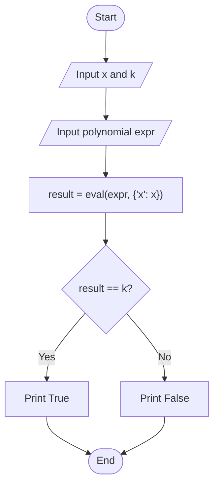

---

## Time and Space Complexity
- Time Complexity: `O(n)` where `n` is length/complexity of the expression
- Space Complexity: `O(1)` auxiliary (excluding expression storage)

---

# Problem Statement 37: Exceptions

## Problem Idea
For each test case, perform integer division `a // b`. If input is invalid or division by zero occurs, print the corresponding error code.

---

## Explanation
Each test case is wrapped in a `try-except` block:
- Parse two integers from input.
- Print integer division result.
- Catch `ZeroDivisionError` for division by zero.
- Catch `ValueError` for malformed integers.

The program prints errors in HackerRank-required format: `Error Code: <message>`.

---

## Step-by-Step Algorithm
1. Start.
2. Read integer `T`.
3. Repeat `T` times:
   - Read one input line.
   - Try to parse `a`, `b` as integers.
   - Try printing `a // b`.
   - If `ZeroDivisionError`, print error code.
   - If `ValueError`, print error code.
4. End.

---

## Flowchart

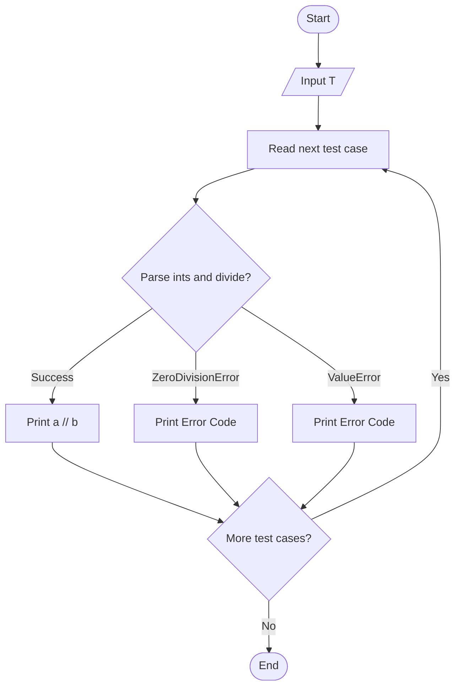

---

## Time and Space Complexity
- Time Complexity: `O(T)`
- Space Complexity: `O(1)`

---

# Problem Statement 38: Text Alignment (HackerRank Logo)

## Problem Idea
Print the HackerRank logo using character alignment methods: `rjust`, `ljust`, and `center`.

---

## Explanation
The logo has five regions:
- Top cone
- Top pillars
- Middle belt
- Bottom pillars
- Bottom cone

Each region is printed using loops and string multiplication with alignment formatting. The thickness controls the size of all sections.

---

## Step-by-Step Algorithm
1. Start.
2. Read odd integer `thickness` and set `c = 'H'`.
3. Print top cone using `rjust` and `ljust`.
4. Print top pillars using `center`.
5. Print middle belt using `center`.
6. Print bottom pillars using `center`.
7. Print bottom cone using `rjust`, `ljust`, then outer `rjust`.
8. End.

---

## Flowchart

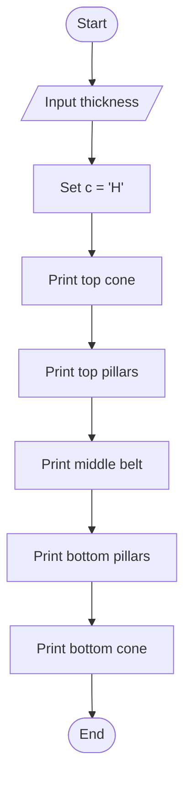

---

## Time and Space Complexity
- Time Complexity: `O(t^2)` where `t` is thickness (total printed characters dominate)
- Space Complexity: `O(1)` auxiliary

---

# Problem Statement 39: Designer Door Mat

## Problem Idea
Given dimensions `N x M`, print a symmetric door mat pattern with `.|.` motifs and a centered `WELCOME` line.

---

## Explanation
The pattern has three parts:
- Top half: increasing motif counts (`1, 3, 5, ...`)
- Middle line: `WELCOME`
- Bottom half: reverse of top half

Each line is centered within width `M` and padded with `-`.

---

## Step-by-Step Algorithm
1. Start.
2. Read `N` and `M`.
3. For odd `i` from `1` to `N-1`, print `(".|." * i).center(M, '-')`.
4. Print `"WELCOME".center(M, '-')`.
5. For odd `i` from `N-2` down to `1`, print centered motif lines.
6. End.

---

## Flowchart

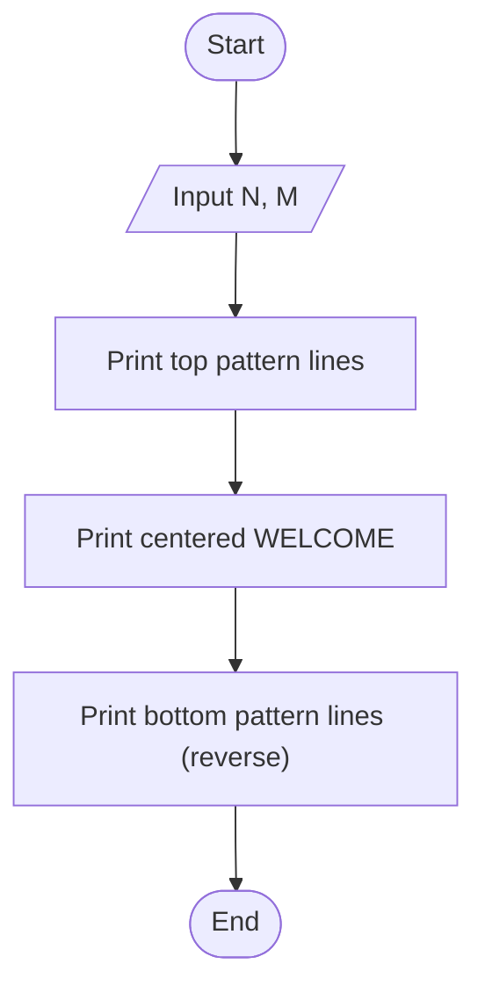

---

## Time and Space Complexity
- Time Complexity: `O(N * M)`
- Space Complexity: `O(M)` per line string construction

---

# Problem Statement 40: Text Wrap

## Problem Idea
Given a string and width, wrap the string into lines where each line has at most `max_width` characters.

---

## Explanation
The solution uses Python's `textwrap.fill`:
- Automatically inserts newline breaks at the given width.
- Returns one formatted multi-line string.

Then the wrapped result is printed.

---

## Step-by-Step Algorithm
1. Start.
2. Read `string` and `max_width`.
3. Compute `result = textwrap.fill(string, max_width)`.
4. Print `result`.
5. End.

---

## Flowchart

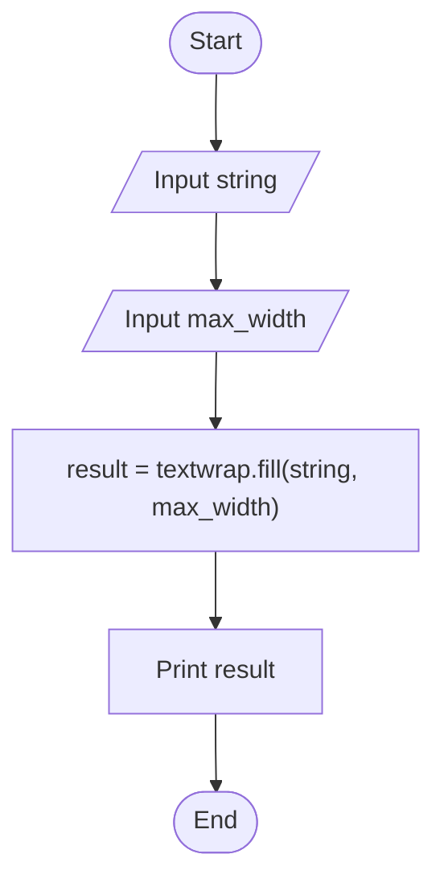

---

## Time and Space Complexity
- Time Complexity: `O(n)` where `n` is string length
- Space Complexity: `O(n)` for wrapped output string

---

# Problem Statement 32: collections.Counter() (Shoe Shop)

## Problem Idea
Given available shoe sizes and customer requests `(size, price)`, sell a shoe only if size is in stock and compute total earnings.

---

## Explanation
The solution uses `Counter` to track quantity of each shoe size.

- For each customer, check if `stock[size] > 0`.
- If available, add `price` to total and decrement stock.
- Print total earned amount.

---

## Step-by-Step Algorithm
1. Read `X` and shoe sizes list.
2. Create `stock = Counter(shoe_sizes)`.
3. Read number of customers `N`.
4. For each customer request `(size, price)`:
   - If stock exists, sell and update total.
5. Print total earnings.

---

## Flowchart

```mermaid
flowchart TD
    A([Start]) --> B[/Input shoe sizes/]
    B --> C["stock = Counter(sizes)"]
    C --> D[/Input N customers/]
    D --> E["For each request: size, price"]
    E --> F{stock[size] > 0?}
    F -- Yes --> G["total += price; stock[size] -= 1"]
    F -- No --> H["Skip sale"]
    G --> I{More customers?}
    H --> I
    I -- Yes --> E
    I -- No --> J["Print total"]
    J --> Z([End])
```

---

## Time and Space Complexity
- Time Complexity: `O(X + N)`
- Space Complexity: `O(X)`

---

# Problem Statement 33: DefaultDict Tutorial (Word Positions)

## Problem Idea
Store 1-indexed positions of words in Group A and, for each word in Group B, print all positions or `-1` if absent.

---

## Explanation
The solution builds a dictionary mapping each word to a list of occurrence indices from Group A.
Then each Group B query checks dictionary presence:

- If present: print joined positions.
- Else: print `-1`.

---

## Step-by-Step Algorithm
1. Read `n` and `m`.
2. For `i` in `1..n`, store positions of Group A words.
3. For each of `m` words in Group B:
   - Print indices if found.
   - Otherwise print `-1`.

---

## Flowchart

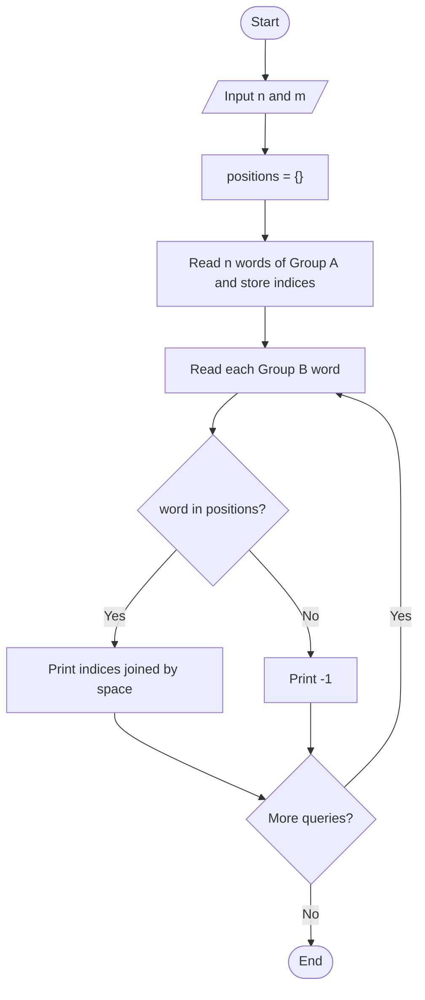

---

## Time and Space Complexity
- Time Complexity: `O(n + m + total_matches)`
- Space Complexity: `O(n)`

---

# Problem Statement 34: Zipped! (Student Averages)

## Problem Idea
Given marks for `N` students across `X` subjects, compute and print each student's average.

---

## Explanation
The program accumulates each student's total marks subject-by-subject, then divides each total by `X`.
Output is printed with one decimal place.

---

## Step-by-Step Algorithm
1. Read `N` (students) and `X` (subjects).
2. Initialize `student_marks` totals with zeros.
3. Repeat for each subject:
   - Read marks of all `N` students.
   - Add each mark to corresponding student's total.
4. For each student total, compute `average = total / X`.
5. Print average with one decimal.

---

## Flowchart

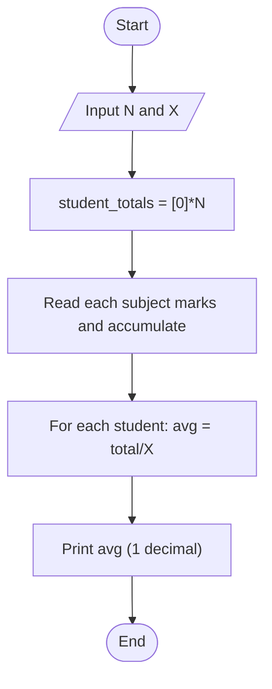

---

## Time and Space Complexity
- Time Complexity: `O(N * X)`
- Space Complexity: `O(N)`

---

# Problem Statement 28: Polar Coordinates

## Problem Idea
Given a complex number `z`, print:
1. Its modulus `r`
2. Its phase angle `phi`

---

## Explanation
The solution uses `cmath.polar(z)` which returns a tuple `(r, phi)`:
- `r` is distance from origin
- `phi` is angle in radians

---

## Step-by-Step Algorithm
1. Read complex number `z`.
2. Use `cmath.polar(z)` to get `r` and `phi`.
3. Print `r`.
4. Print `phi`.

---

## Flowchart

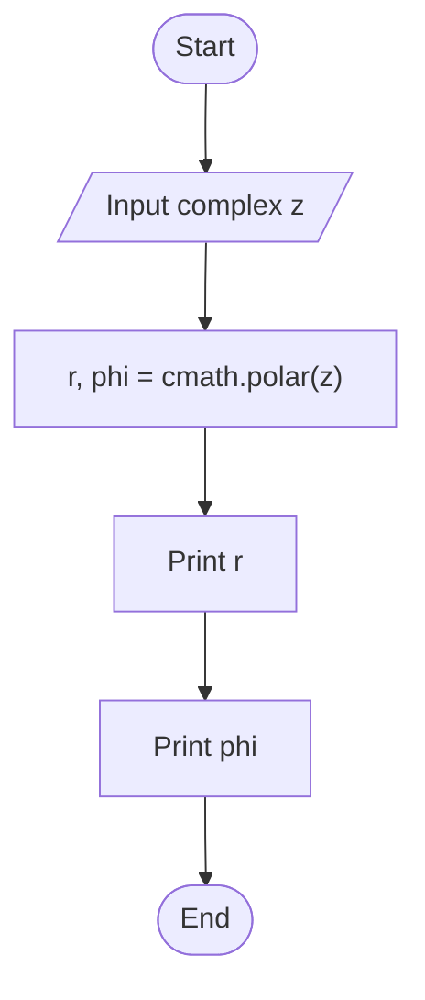

---

## Time and Space Complexity
- Time Complexity: `O(1)`
- Space Complexity: `O(1)`

---

# Problem Statement 29: Divmod

## Problem Idea
Given integers `a` and `b`, print:
1. Integer division `a // b`
2. Modulo `a % b`
3. `divmod(a, b)` tuple

---

## Explanation
`divmod(a, b)` returns `(a // b, a % b)` in one call.
The program prints quotient, remainder, then full tuple.

---

## Step-by-Step Algorithm
1. Read `a` and `b`.
2. Compute `res = divmod(a, b)`.
3. Print `res[0]`.
4. Print `res[1]`.
5. Print `res`.

---

## Flowchart

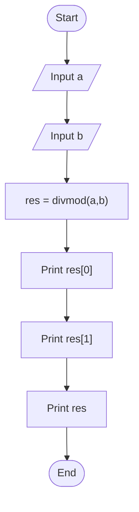

---

## Time and Space Complexity
- Time Complexity: `O(1)`
- Space Complexity: `O(1)`

---

# Problem Statement 30: Power - Mod Power

## Problem Idea
Given integers `a`, `b`, and `m`, print:
1. `pow(a, b)`
2. `pow(a, b, m)`

---

## Explanation
The first expression computes standard exponentiation. The second computes modular exponentiation efficiently.

---

## Step-by-Step Algorithm
1. Read `a`, `b`, and `m`.
2. Print `pow(a, b)`.
3. Print `pow(a, b, m)`.

---

## Flowchart

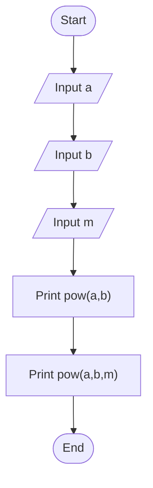

---

## Time and Space Complexity
- Time Complexity: `O(log b)` for modular power (efficient exponentiation)
- Space Complexity: `O(1)`

---

# Problem Statement 31: Integers Come in All Sizes

## Problem Idea
Read `a`, `b`, `c`, `d` and print the value of `a^b + c^d`.

---

## Explanation
Python supports arbitrarily large integers, so very large exponent results are handled directly.

---

## Step-by-Step Algorithm
1. Read integers `a`, `b`, `c`, `d`.
2. Compute `a**b + c**d`.
3. Print the result.

---

## Flowchart

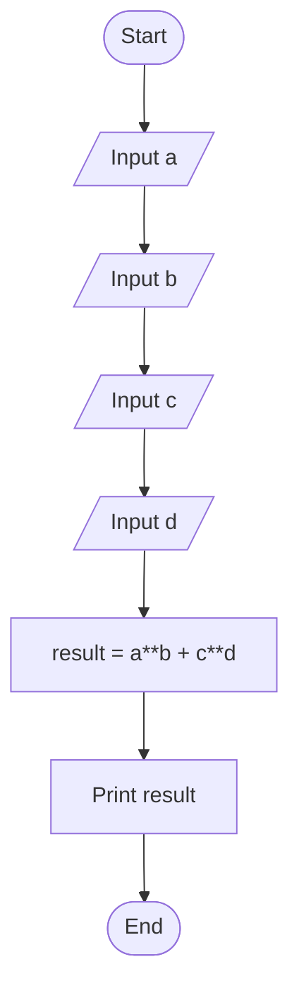

---

## Time and Space Complexity
- Time Complexity: Depends on exponent sizes (`b`, `d`) and big-integer arithmetic
- Space Complexity: Depends on size of resulting big integers

---

# Problem Statement 20: Introduction to Sets (Average)

## Problem Idea
Given an array, compute the average of distinct values only.

---

## Explanation
The function converts the input list to a set to remove duplicates, then computes:
- `sum(distinct) / len(distinct)`

---

## Step-by-Step Algorithm
1. Read list `array`.
2. Convert to set `distinct`.
3. Compute average using sum and length.
4. Print result.

---

## Flowchart

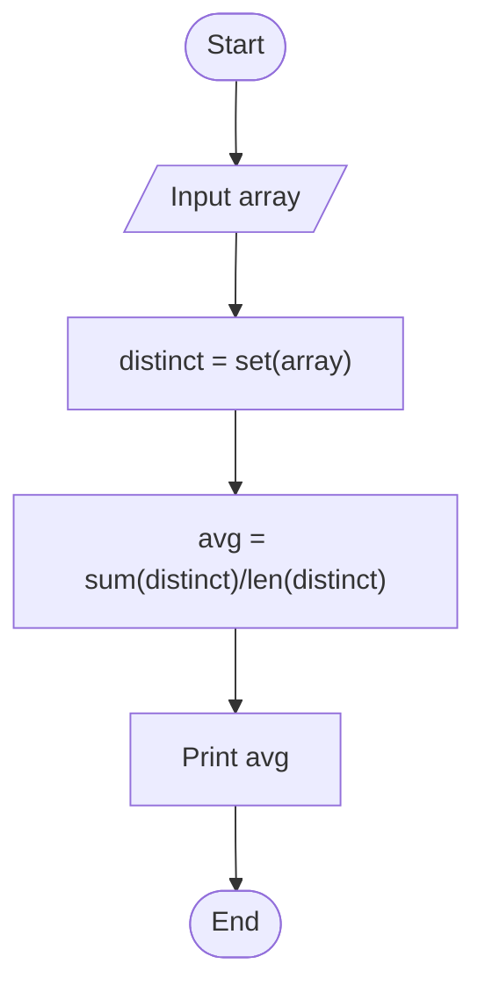

---

## Time and Space Complexity
- Time Complexity: `O(n)`
- Space Complexity: `O(n)`

---

# Problem Statement 21: No Idea! (Distinct Country Stamps)

## Problem Idea
Count how many distinct country names exist in `N` stamp entries.

---

## Explanation
The solution stores country names in a set; duplicates are automatically ignored. Final answer is `len(set)`.

---

## Step-by-Step Algorithm
1. Read `n`.
2. Initialize empty set `stamps`.
3. Add each input country to set.
4. Print size of set.

---

## Flowchart

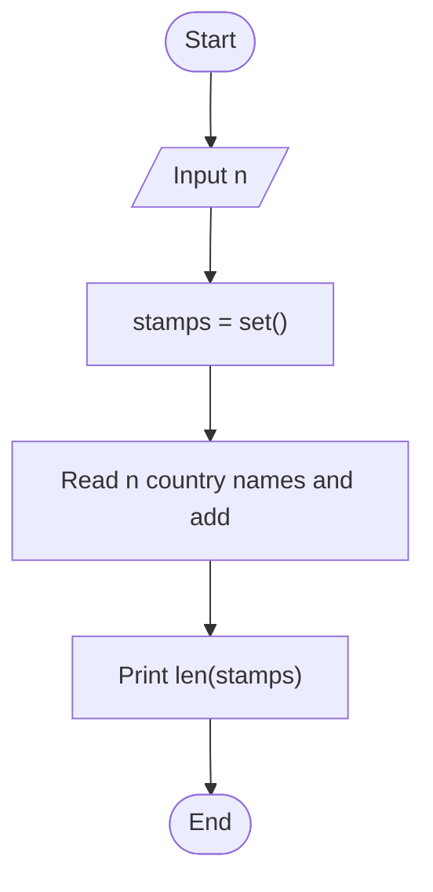

---

## Time and Space Complexity
- Time Complexity: `O(n)`
- Space Complexity: `O(n)`

---

# Problem Statement 22: Set .discard(), .remove() & .pop()

## Problem Idea
Perform `N` set operations (`pop`, `remove x`, `discard x`) on set `s`, then print sum of remaining elements.

---

## Explanation
For each command:
- `pop` removes an arbitrary element.
- `remove x` removes x (error if absent).
- `discard x` removes x if present.

After all operations, print `sum(s)`.

---

## Step-by-Step Algorithm
1. Read set `s`.
2. Read number of commands `N`.
3. Execute each command based on operation type.
4. Print sum of final set.

---

## Flowchart

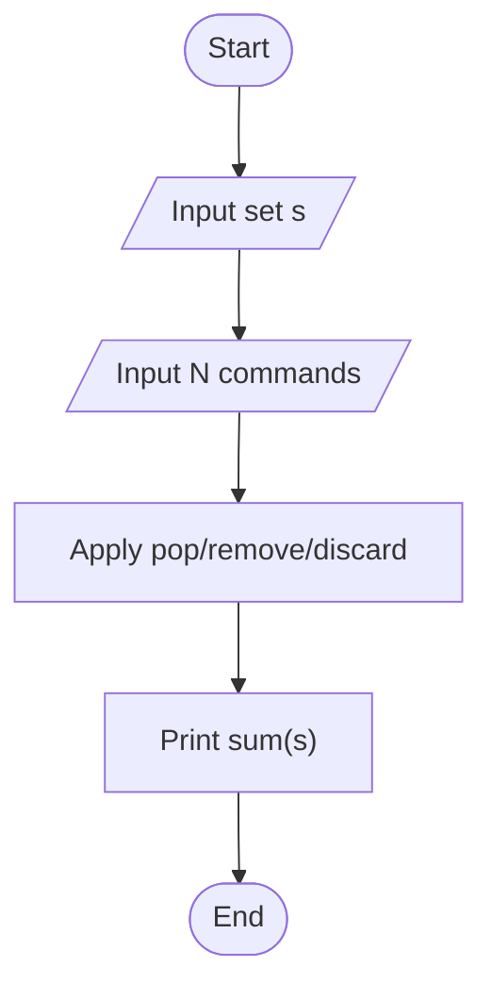

---

## Time and Space Complexity
- Time Complexity: `O(N)` average
- Space Complexity: `O(n)`

---

# Problem Statement 23: Set Union Operation

## Problem Idea
Given English and French subscriber sets, print count of students subscribed to at least one newspaper.

---

## Explanation
Use `english.union(french)`, then print its length.

---

## Step-by-Step Algorithm
1. Read both sets.
2. Compute union.
3. Print union size.

---

## Flowchart

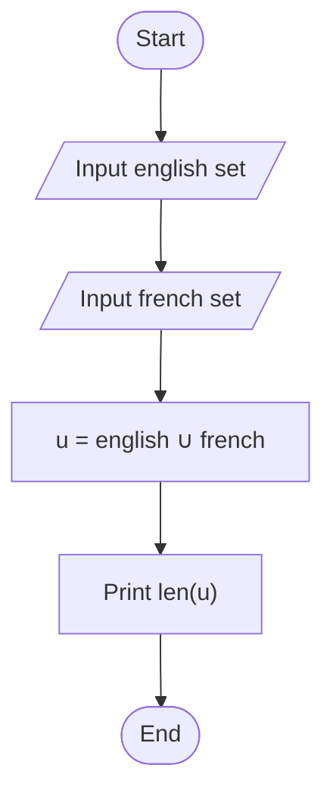

---

## Time and Space Complexity
- Time Complexity: `O(n + m)`
- Space Complexity: `O(n + m)`

---

# Problem Statement 24: Set Intersection Operation

## Problem Idea
Print number of students subscribed to both newspapers.

---

## Explanation
Compute `english.intersection(french)` and print its length.

---

## Step-by-Step Algorithm
1. Read both sets.
2. Compute intersection.
3. Print intersection size.

---

## Flowchart

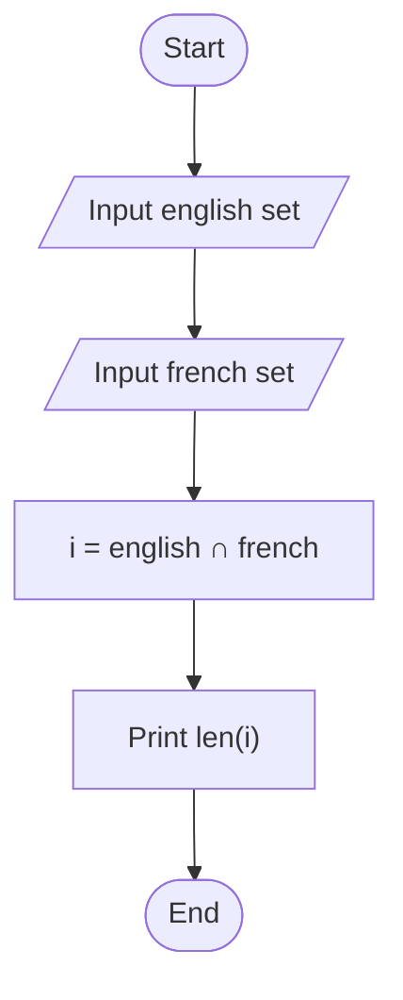

---

## Time and Space Complexity
- Time Complexity: `O(min(n,m))`
- Space Complexity: `O(min(n,m))`

---

# Problem Statement 25: Set Difference Operation

## Problem Idea
Print number of students subscribed to English only.

---

## Explanation
Use `english.difference(french)` and print its size.

---

## Step-by-Step Algorithm
1. Read both sets.
2. Compute `english - french`.
3. Print size.

---

## Flowchart

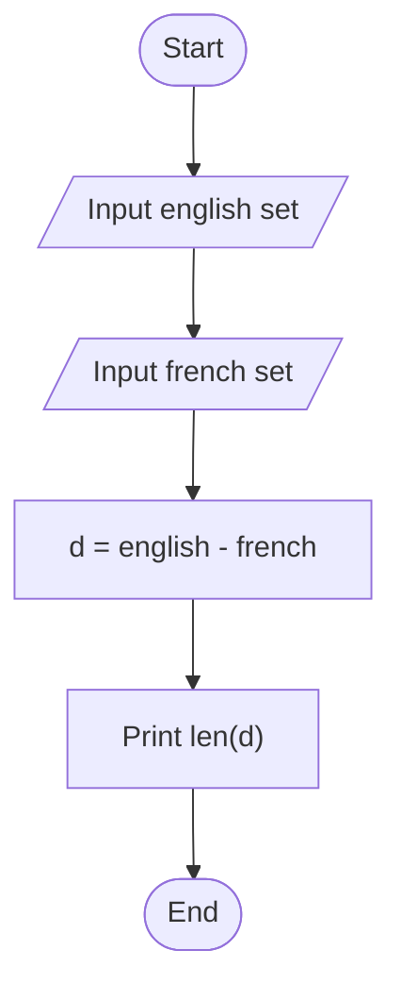

---

## Time and Space Complexity
- Time Complexity: `O(n)` average
- Space Complexity: `O(n)`

---

# Problem Statement 25 (Second): Set Symmetric Difference Operation

## Problem Idea
Print number of students subscribed to exactly one newspaper (not both).

---

## Explanation
Use `english.symmetric_difference(french)` and print its size.

---

## Step-by-Step Algorithm
1. Read both sets.
2. Compute symmetric difference.
3. Print its size.

---

## Flowchart

```mermaid
flowchart TD
    A([Start]) --> B[/Input english set/]
    B --> C[/Input french set/]
    C --> D["sd = english Δ french"]
    D --> E["Print len(sd)"]
    E --> Z([End])
```

---

## Time and Space Complexity
- Time Complexity: `O(n + m)`
- Space Complexity: `O(n + m)`

---

# Problem Statement 26: Symmetric Difference (Sorted Output)

## Problem Idea
Given sets `M` and `N`, print symmetric difference elements in ascending order, one per line.

---

## Explanation
Compute `N.symmetric_difference(M)`, sort the result, print each value line-by-line.

---

## Step-by-Step Algorithm
1. Read two sets.
2. Compute symmetric difference.
3. Sort values.
4. Print each value.

---

## Flowchart

```mermaid
flowchart TD
    A([Start]) --> B[/Input set N/]
    B --> C[/Input set M/]
    C --> D["sd = N Δ M"]
    D --> E["Sort sd"]
    E --> F["Print each value"]
    F --> Z([End])
```

---

## Time and Space Complexity
- Time Complexity: `O((n+m) log(n+m))`
- Space Complexity: `O(n+m)`

---

# Problem Statement 27: Set Mutations

## Problem Idea
Apply multiple set mutation operations (`update`, `intersection_update`, `difference_update`, `symmetric_difference_update`) on set `A`, then print sum of final elements.

---

## Explanation
For each operation line, read operation name and another set, then apply corresponding in-place mutation to `A`.
After all operations, print `sum(A)`.

---

## Step-by-Step Algorithm
1. Read initial set `A`.
2. Read number of operations `N`.
3. Repeat `N` times:
   - Read operation name.
   - Read `other_set`.
   - Apply matching mutation to `A`.
4. Print `sum(A)`.

---

## Flowchart

```mermaid
flowchart TD
    A([Start]) --> B[/Input set A/]
    B --> C[/Input N operations/]
    C --> D["For each: read op + other_set"]
    D --> E["Apply mutation on A"]
    E --> F["Print sum(A)"]
    F --> Z([End])
```

---

## Time and Space Complexity
- Time Complexity: `O(total elements processed across operations)`
- Space Complexity: `O(|A| + |other_set|)`

---

# Problem Statement 18: Find a String

## Problem Idea
Given a string and a substring, count how many times the substring appears in the string by scanning from left to right (including overlapping matches).

---

## Explanation
The function checks every possible starting index in the main string and compares the slice of length `len(sub_string)` with the target substring.

- Initialize `count = 0`.
- Loop from index `0` to `len(string) - len(sub_string)`.
- If the current slice matches `sub_string`, increment `count`.
- Return `count`.

This approach naturally counts overlapping occurrences.

---

## Step-by-Step Algorithm
1. Start.
2. Read `string` and `sub_string`.
3. Set `count = 0`.
4. Compute `sub_len = len(sub_string)`.
5. For each index `i` from `0` to `len(string) - sub_len`:
   - If `string[i:i+sub_len] == sub_string`, increment `count`.
6. Print `count`.
7. End.

---

## Flowchart

```mermaid
flowchart TD
    A([Start]) --> B[/Input string/]
    B --> C[/Input sub_string/]
    C --> D["count = 0"]
    D --> E["i = 0"]
    E --> F{i <= len(string)-len(sub_string)?}
    F -- No --> G["Print count"]
    G --> Z([End])
    F -- Yes --> H{string[i:i+sub_len] == sub_string?}
    H -- Yes --> I["count = count + 1"]
    H -- No --> J["i = i + 1"]
    I --> J
    J --> F
```

---

## Time and Space Complexity
- Time Complexity: `O(n * m)` in worst case (`n` = length of string, `m` = length of substring)
- Space Complexity: `O(1)` (excluding input storage)

---

# Problem Statement 19: String Validators

## Problem Idea
Given a string `S`, print whether it contains:
1. any alphanumeric characters
2. any alphabetical characters
3. any digits
4. any lowercase characters
5. any uppercase characters

---

## Explanation
The solution uses Python built-in checks with `any()` over each character:

- `isalnum()` for alphanumeric
- `isalpha()` for alphabetic
- `isdigit()` for digits
- `islower()` for lowercase
- `isupper()` for uppercase

Each result is printed as `True` or `False` on separate lines.

---

## Step-by-Step Algorithm
1. Start.
2. Read input string `s`.
3. Check and print `any(c.isalnum() for c in s)`.
4. Check and print `any(c.isalpha() for c in s)`.
5. Check and print `any(c.isdigit() for c in s)`.
6. Check and print `any(c.islower() for c in s)`.
7. Check and print `any(c.isupper() for c in s)`.
8. End.

---

## Flowchart

```mermaid
flowchart TD
    A([Start]) --> B[/Input s/]
    B --> C["Print any isalnum"]
    C --> D["Print any isalpha"]
    D --> E["Print any isdigit"]
    E --> F["Print any islower"]
    F --> G["Print any isupper"]
    G --> Z([End])
```

---

## Time and Space Complexity
- Time Complexity: `O(n)` for each check; overall `O(n)` with constant-factor multiple passes
- Space Complexity: `O(1)` (generator expressions)

---

# Problem Statement 17: Mutations

## Problem Idea
Given a string, change the character at a specific index and print the updated string.

---

## Explanation
Python strings are immutable, so direct character replacement is not allowed.

Your function handles this by:
- Converting the string into a list of characters.
- Replacing the element at the target index.
- Joining the list back into a string.

This is a standard and clean way to mutate one character in a string.

---

## Step-by-Step Algorithm
1. Start.
2. Read input string `s`.
3. Read `position` and `character`.
4. Convert `s` to list `lst`.
5. Set `lst[position] = character`.
6. Join `lst` into `updated_string`.
7. Print `updated_string`.
8. End.

---

## Flowchart

```mermaid
flowchart TD
    A([Start]) --> B[/Input string s/]
    B --> C[/Input position and character/]
    C --> D["lst = list(s)"]
    D --> E["lst[position] = character"]
    E --> F["updated = ''.join(lst)"]
    F --> G["Print updated"]
    G --> Z([End])
```

---

## Time and Space Complexity
- Time Complexity: `O(n)` where `n` is length of string
- Space Complexity: `O(n)` (character list and rebuilt string)

---

# Problem Statement 2
# Weird or Not Weird - Explanation and Algorithm

## Problem Idea
Given an integer `n`, print:
- `Weird` if `n` is odd.
- `Not Weird` if `n` is even and in the range 2 to 5.
- `Weird` if `n` is even and in the range 6 to 20.
- `Not Weird` if `n` is even and greater than 20.

Also, if input is not in the valid range 1 to 100, print:
`Please enter a number between 1 and 100.`

---

## Explanation
The program first checks whether the input value is valid (between 1 and 100).

- If invalid, it immediately prints the warning message.
- If valid, it checks number properties in order:
	1. Odd number -> `Weird`
	2. Even and 2 to 5 -> `Not Weird`
	3. Even and 6 to 20 -> `Weird`
	4. Even and above 20 -> `Not Weird`

This order is important because only one condition should be matched and printed.

---

## Step-by-Step Algorithm
1. Start.
2. Read integer `n`.
3. If `n < 1` or `n > 100`, print the range warning and stop.
4. Else, if `n` is odd (`n % 2 == 1`), print `Weird`.
5. Else, if `n` is between 2 and 5 (inclusive), print `Not Weird`.
6. Else, if `n` is between 6 and 20 (inclusive), print `Weird`.
7. Else (so `n > 20`), print `Not Weird`.
8. End.

---

## Flowchart

```mermaid
flowchart TD
		A([Start]) --> B[/Input n/]
		B --> C{n < 1 or n > 100?}

		C -- Yes --> D[Print: "Please enter a number between 1 and 100."]
		D --> Z([End])

		C -- No --> E{n % 2 == 1?}
		E -- Yes --> F[Print: "Weird"]
		F --> Z

		E -- No --> G{2 <= n <= 5?}
		G -- Yes --> H[Print: "Not Weird"]
		H --> Z

		G -- No --> I{6 <= n <= 20?}
		I -- Yes --> J[Print: "Weird"]
		J --> Z

		I -- No --> K[Print: "Not Weird"]
		K --> Z
```

---

## Time and Space Complexity
- Time Complexity: `O(1)` (constant checks)
- Space Complexity: `O(1)`

---

# Problem Statement 3: Arithmetic Operations

## Problem Idea
Given two integers `a` and `b`, print:
1. The sum of `a + b`
2. The difference `a - b`
3. The product `a * b`

---

## Explanation
The program reads two integers and performs three basic arithmetic operations on them. Each result is printed on a separate line in order: sum, difference, then product.

---

## Step-by-Step Algorithm
1. Start.
2. Read integer `a`.
3. Read integer `b`.
4. Compute and print `a + b`.
5. Compute and print `a - b`.
6. Compute and print `a * b`.
7. End.

---

## Flowchart

```mermaid
flowchart TD
    A([Start]) --> B[/Input a/]
    B --> C[/Input b/]
    C --> D["sum = a + b"]
    D --> E["diff = a - b"]
    E --> F["prod = a * b"]
    F --> G["Print sum"]
    G --> H["Print diff"]
    H --> I["Print prod"]
    I --> Z([End])
```

---

## Time and Space Complexity
- Time Complexity: `O(1)` (three arithmetic operations)
- Space Complexity: `O(1)`

---

# Problem Statement 4: Integer and Float Division

## Problem Idea
Given two integers `a` and `b`, print:
1. Integer division result: `a // b`
2. Float division result: `a / b`

Handle the edge case where `b = 0`.

---

## Explanation
The program performs two types of division:
- **Integer division** (`a // b`): Divides and discards the decimal part.
- **Float division** (`a / b`): Divides and returns the decimal result.

Division by zero is handled with error checking. If `b = 0` and `a ≠ 0`, print an error. If both are 0, print two 0s.

---

## Step-by-Step Algorithm
1. Start.
2. Read integer `a`.
3. Read integer `b`.
4. If `b = 0`:
   - If `a ≠ 0`: print "Cannot divide by zero".
   - Else (both are 0): print 0 and 0.
5. Else (b ≠ 0):
   - Compute and print integer division `a // b`.
   - Compute and print float division `a / b`.
6. End.

---

## Flowchart

```mermaid
flowchart TD
    A([Start]) --> B[/Input a/]
    B --> C[/Input b/]
    C --> D{b == 0?}
    
    D -- Yes --> E{a == 0?}
    E -- Yes --> F["Print 0"]
    F --> G["Print 0"]
    G --> Z([End])
    
    E -- No --> H["Print 'Cannot divide by zero'"]
    H --> Z
    
    D -- No --> I["int_div = a // b"]
    I --> J["float_div = a / b"]
    J --> K["Print int_div"]
    K --> L["Print float_div"]
    L --> Z
```

---

## Time and Space Complexity
- Time Complexity: `O(1)` (division operations)
- Space Complexity: `O(1)`

---

# Problem Statement 5: Print Squares of Numbers

## Problem Idea
Given an integer `n`, print the squares of all integers from 0 to n-1: `0², 1², 2², ..., (n-1)²`.

Constraint: `1 ≤ n ≤ 20`

---

## Explanation
The program uses a loop to iterate from 0 to n-1. For each iteration, it computes and prints the square of the current number. Input validation ensures `n` is within bounds.

---

## Step-by-Step Algorithm
1. Start.
2. Read integer `n`.
3. If `n < 1` or `n > 20`, print "Follow the constraints" and stop.
4. Else, initialize loop variable `i = 0`.
5. While `i < n`:
   - Compute and print `i²` (i.e., `i * i`).
   - Increment `i` by 1.
6. End.

---

## Flowchart

```mermaid
flowchart TD
    A([Start]) --> B[/Input n/]
    B --> C{1 ≤ n ≤ 20?}
    
    C -- No --> D["Print 'Follow the constraints'"]
    D --> Z([End])
    
    C -- Yes --> E["i = 0"]
    E --> F{i < n?}
    
    F -- Yes --> G["Print i²"]
    G --> H["i = i + 1"]
    H --> F
    
    F -- No --> Z
```

---

## Time and Space Complexity
- Time Complexity: `O(n)` (loop runs n times)
- Space Complexity: `O(1)`

---

# Problem Statement 6: Leap Year Checker

## Problem Idea
Determine if a given year is a leap year based on the Gregorian calendar rules:
- Divisible by 400 → Leap year
- Divisible by 100 (but not 400) → Not a leap year
- Divisible by 4 (but not 100) → Leap year
- Otherwise → Not a leap year

Constraint: `1900 ≤ year ≤ 10⁵`

---

## Explanation
A leap year is determined by three conditions checked in priority order:
1. If divisible by 400, it's a leap year.
2. If divisible by 100 (but not 400), it's **not** a leap year.
3. If divisible by 4 (but not 100), it's a leap year.
4. Otherwise, it's not a leap year.

The function returns `True` or `False`.

---

## Step-by-Step Algorithm
1. Start.
2. Read year.
3. If year is outside range [1900, 10⁵], return `False`.
4. Else, check leap year conditions:
   - If `year % 400 == 0`, return `True`.
   - Else if `year % 4 == 0` and `year % 100 ≠ 0`, return `True`.
   - Else, return `False`.
5. End.

---

## Flowchart

```mermaid
flowchart TD
    A([Start]) --> B[/Input year/]
    B --> C{1900 ≤ year ≤ 10⁵?}
    
    C -- No --> D["Return False"]
    D --> Z([End])
    
    C -- Yes --> E{year % 400 == 0?}
    E -- Yes --> F["Return True"]
    F --> Z
    
    E -- No --> G{year % 4 == 0 AND<br/>year % 100 ≠ 0?}
    G -- Yes --> H["Return True"]
    H --> Z
    
    G -- No --> I["Return False"]
    I --> Z
```

---

## Time and Space Complexity
- Time Complexity: `O(1)` (constant modulo operations)
- Space Complexity: `O(1)`

---

# Problem Statement 7: Print Consecutive Numbers

## Problem Idea
Given an integer `n`, print all integers from 1 to n **without spaces or line breaks** (as a single concatenated line).

Example: For n=3, output: `123`

Constraint: `1 ≤ n ≤ 150`

---

## Explanation
The program uses a loop to iterate from 1 to n and prints each number with `end=""` to prevent automatic line breaks. This concatenates all numbers into a single line. Input validation checks the constraint range.

---

## Step-by-Step Algorithm
1. Start.
2. Read integer `n`.
3. If `n < 1` or `n > 150`, print "Follow the Constraints" and stop.
4. Else, loop from `i = 1` to `i = n`:
   - Print `i` without a line break (using `end=""`).
5. End.

---

## Flowchart

```mermaid
flowchart TD
    A([Start]) --> B[/Input n/]
    B --> C{1 ≤ n ≤ 150?}
    
    C -- No --> D["Print 'Follow the Constraints'"]
    D --> Z([End])
    
    C -- Yes --> E["i = 1"]
    E --> F{i ≤ n?}
    
    F -- Yes --> G["Print i (no break)"]
    G --> H["i = i + 1"]
    H --> F
    
    F -- No --> Z
```

---

## Time and Space Complexity
- Time Complexity: `O(n)` (loop runs n times)
- Space Complexity: `O(1)`

---

# Problem Statement 8: 3D Coordinates

## Problem Idea
Given four integers `x`, `y`, `z`, and `n`, print all possible coordinates `(i, j, k)` where:
- `0 ≤ i ≤ x`
- `0 ≤ j ≤ y`
- `0 ≤ k ≤ z`
- `i + j + k ≠ n`

The output is a list of lists where each coordinate is excluded if its sum equals `n`.

---

## Explanation
The program generates all possible triples in a 3D grid using **list comprehension** with three nested loops. It filters out coordinates where the sum `i + j + k` equals `n`. The result is a list of lists (2D array format).

---

## Step-by-Step Algorithm
1. Start.
2. Read integers `x`, `y`, `z`, and `n`.
3. Create a list comprehension:
   - Loop through all `i` from 0 to `x`.
   - For each `i`, loop through all `j` from 0 to `y`.
   - For each `(i, j)`, loop through all `k` from 0 to `z`.
   - Add `[i, j, k]` to the list if `i + j + k ≠ n`.
4. Print the list.
5. End.

---

## Flowchart

```mermaid
flowchart TD
    A([Start]) --> B[/Input x/]
    B --> C[/Input y/]
    C --> D[/Input z/]
    D --> E[/Input n/]
    E --> F["result = []"]
    F --> G["i = 0"]
    
    G --> H{i ≤ x?}
    H -- No --> L["Print result"]
    L --> Z([End])
    
    H -- Yes --> I["j = 0"]
    I --> J{j ≤ y?}
    J -- No --> K["i = i + 1"]
    K --> H
    
    J -- Yes --> M["k = 0"]
    M --> N{k ≤ z?}
    N -- No --> O["j = j + 1"]
    O --> J
    
    N -- Yes --> P{i + j + k ≠ n?}
    P -- Yes --> Q["Add [i,j,k] to result"]
    Q --> R["k = k + 1"]
    R --> N
    
    P -- No --> R
```

---

## Time and Space Complexity
- Time Complexity: `O(x * y * z)` (three nested loops)
- Space Complexity: `O(x * y * z)` (for the output list)

---

# Problem Statement 9: Alphabet Rangoli

## Problem Idea
Given an integer `N`, print an alphabet rangoli pattern of size `N` using lowercase letters and hyphens (`-`).

---

## Explanation
The function builds the rangoli in two halves:
- It first creates each row from top to middle using slices of the alphabet.
- For each row, letters are mirrored around the center and joined with hyphens.
- Each row is centered using a fixed width: `4 * size - 3`.
- Finally, the full pattern is formed by combining the upper half in reverse plus the lower half.

---

## Step-by-Step Algorithm
1. Start.
2. Read integer `size`.
3. Store lowercase letters in `alpha`.
4. Initialize an empty list `lines`.
5. For `i` from `0` to `size - 1`:
   - Take `s = alpha[i:size]`.
   - Build mirrored row: `s[::-1] + s[1:]`.
   - Join with `-` and center to width `4 * size - 3`.
   - Append row to `lines`.
6. Print `lines[::-1] + lines[1:]` line by line.
7. End.

---

## Flowchart

```mermaid
flowchart TD
    A([Start]) --> B[/Input size/]
    B --> C["alpha = a..z"]
    C --> D["lines = []"]
    D --> E["i = 0"]

    E --> F{i < size?}
    F -- No --> G["Print lines[::-1] + lines[1:]"]
    G --> Z([End])

    F -- Yes --> H["s = alpha[i:size]"]
    H --> I["row = '-'.join(s[::-1] + s[1:])"]
    I --> J["row = row.center(4*size-3, '-')"]
    J --> K["Append row to lines"]
    K --> L["i = i + 1"]
    L --> F
```

---

## Time and Space Complexity
- Time Complexity: `O(size^2)` (building and formatting each row)
- Space Complexity: `O(size^2)` (storing output rows)

---

# Problem Statement 10: Capitalize Full Name

## Problem Idea
Given a full name string, capitalize the first letter of each word while preserving spaces between words.

---

## Explanation
The function:
- Splits the input string by spaces.
- Capitalizes each word using `capitalize()`.
- Joins all words back with spaces.

This ensures names like `alison heck` become `Alison Heck`.

---

## Step-by-Step Algorithm
1. Start.
2. Read input string `s`.
3. Split `s` into words by spaces.
4. For each word, apply `capitalize()`.
5. Join transformed words using spaces.
6. Return/print the final string.
7. End.

---

## Flowchart

```mermaid
flowchart TD
    A([Start]) --> B[/Input full name s/]
    B --> C["words = s.split(' ')"]
    C --> D["capitalized = [w.capitalize() for w in words]"]
    D --> E["result = ' '.join(capitalized)"]
    E --> F["Print/Return result"]
    F --> Z([End])
```

---

## Time and Space Complexity
- Time Complexity: `O(n)` where `n` is length of input string
- Space Complexity: `O(n)` for split/join intermediate data

---

# Problem Statement 11: Nested Lists (Second Lowest Grade)

## Problem Idea
Given `N` student records as `[name, score]`, print the name(s) of students who have the **second lowest** score. If multiple students share that score, print names in alphabetical order.

---

## Explanation
The program solves this in clear phases:
- Read all student records into a nested list.
- Find the minimum score.
- Find the smallest score strictly greater than the minimum (second lowest).
- Collect all names with second-lowest score.
- Sort names alphabetically and print each on a new line.

This handles ties correctly and ensures output order is deterministic.

---

## Step-by-Step Algorithm
1. Start.
2. Read integer `n` (number of students).
3. Repeat `n` times:
    - Read `name`.
    - Read `score`.
    - Append `[name, score]` to `records`.
4. Set `lowest = +infinity` and scan all scores to find the minimum.
5. Set `second_lowest = +infinity` and scan all scores again:
    - If `lowest < score < second_lowest`, update `second_lowest`.
6. Create `names` list of students where `score == second_lowest`.
7. Sort `names` alphabetically.
8. Print each name on a new line.
9. End.

---

## Flowchart

```mermaid
flowchart TD
     A([Start]) --> B[/Input n/]
     B --> C["records = []"]
     C --> D["Read n pairs: name, score"]
     D --> E["Find lowest score"]
     E --> F["Find second_lowest where lowest < score"]
     F --> G["Collect names with score == second_lowest"]
     G --> H["Sort names alphabetically"]
     H --> I["Print each name"]
     I --> Z([End])
```

---

## Time and Space Complexity
- Time Complexity: `O(n log n)` in worst case (sorting selected names dominates)
- Space Complexity: `O(n)` (records + names storage)

---

# Problem Statement 12: Finding the Percentage

## Problem Idea
Store student names with their marks in a dictionary, then print the average marks of a queried student with exactly 2 decimal places.

---

## Explanation
The program reads `n` student entries. Each entry contains a student name and multiple marks.

- It stores data in a dictionary as: `name -> [marks]`.
- It reads the `query_name`.
- It fetches that student's marks list, computes average using:
    - `sum(marks) / len(marks)`
- It prints the result formatted to 2 decimal places using `"{:.2f}".format(average)`.

---

## Step-by-Step Algorithm
1. Start.
2. Read integer `n`.
3. Initialize empty dictionary `student_marks`.
4. Repeat `n` times:
     - Read one line: `name` followed by scores.
     - Convert scores to float list.
     - Store in dictionary: `student_marks[name] = scores`.
5. Read `query_name`.
6. Retrieve `marks = student_marks[query_name]`.
7. Compute `average = sum(marks) / len(marks)`.
8. Print average with 2 decimal places.
9. End.

---

## Flowchart

```mermaid
flowchart TD
        A([Start]) --> B[/Input n/]
        B --> C["student_marks = {}"]
        C --> D["Read n entries: name + marks"]
        D --> E["Store each as name -> list of float marks"]
        E --> F[/Input query_name/]
        F --> G["marks = student_marks[query_name]"]
        G --> H["average = sum(marks)/len(marks)"]
        H --> I["Print average with 2 decimals"]
        I --> Z([End])
```

---

## Time and Space Complexity
- Time Complexity: `O(n + m)` where `n` is number of students and `m` is marks count for queried student
- Space Complexity: `O(total_marks)` for dictionary storage

---

# Problem Statement 13: Lists (Command Processing)

## Problem Idea
Initialize an empty list and process `N` commands. Each command modifies or prints the list.

Supported commands:
- `insert i e`
- `print`
- `remove e`
- `append e`
- `sort`
- `pop`
- `reverse`

---

## Explanation
The program reads the number of commands, then handles each command line one by one:
- It splits command input into tokens.
- The first token decides operation type.
- Depending on operation, it converts needed arguments to integers and applies the matching list method.

This is a direct simulation of list operations as specified in the problem.

---

## Step-by-Step Algorithm
1. Start.
2. Read integer `N`.
3. Initialize empty list `lst`.
4. Repeat `N` times:
   - Read command line and split into tokens.
   - Let first token be `op`.
   - If `op == insert`: parse `i, e` and do `lst.insert(i, e)`.
   - If `op == print`: print `lst`.
   - If `op == remove`: parse `e` and do `lst.remove(e)`.
   - If `op == append`: parse `e` and do `lst.append(e)`.
   - If `op == sort`: do `lst.sort()`.
   - If `op == pop`: do `lst.pop()`.
   - If `op == reverse`: do `lst.reverse()`.
5. End.

---

## Flowchart

```mermaid
flowchart TD
    A([Start]) --> B[/Input N/]
    B --> C["lst = []"]
    C --> D["Read next command"]
    D --> E{More commands left?}
    E -- No --> Z([End])

    E -- Yes --> F["Split command -> op, args"]
    F --> G{op type?}
    G -- insert --> H["lst.insert(i,e)"]
    G -- print --> I["print(lst)"]
    G -- remove --> J["lst.remove(e)"]
    G -- append --> K["lst.append(e)"]
    G -- sort --> L["lst.sort()"]
    G -- pop --> M["lst.pop()"]
    G -- reverse --> N["lst.reverse()"]

    H --> D
    I --> D
    J --> D
    K --> D
    L --> D
    M --> D
    N --> D
```

---

## Time and Space Complexity
- Time Complexity: Depends on command mix; worst-case can reach `O(N^2)` (e.g., repeated inserts/removes near front)
- Space Complexity: `O(k)` where `k` is current list size

---

# Problem Statement 14: sWAP cASE

## Problem Idea
Given a string, convert uppercase letters to lowercase and lowercase letters to uppercase.

Example:
- `Www.HackerRank.com` → `wWW.hACKERrANK.COM`

---

## Explanation
The function uses Python's built-in string method `swapcase()`:
- Every lowercase character becomes uppercase.
- Every uppercase character becomes lowercase.
- Non-alphabetic characters (digits, spaces, symbols) remain unchanged.

In your implementation, `swapcase()` is called and returned as the output string.

---

## Step-by-Step Algorithm
1. Start.
2. Read string `s`.
3. Apply `swapcase()` to `s`.
4. Store the transformed string as result.
5. Print result.
6. End.

---

## Flowchart

```mermaid
flowchart TD
    A([Start]) --> B[/Input string s/]
    B --> C["result = s.swapcase()"]
    C --> D["Print result"]
    D --> Z([End])
```

---

## Time and Space Complexity
- Time Complexity: `O(n)` where `n` is string length
- Space Complexity: `O(n)` for the new transformed string

---

# Problem Statement 15: String Split and Join

## Problem Idea
Given a string, split it by spaces and join the words using hyphens (`-`).

Example:
- `this is a string` → `this-is-a-string`

---

## Explanation
The function performs two string operations:
- `split(" ")` to break the sentence into a list of words.
- `"-".join(...)` to rebuild the sentence using hyphens.

This is a clean way to transform delimiter-separated text.

---

## Step-by-Step Algorithm
1. Start.
2. Read string `line`.
3. Split `line` into words using space delimiter.
4. Join the words using `-`.
5. Print the new string.
6. End.

---

## Flowchart

```mermaid
flowchart TD
    A([Start]) --> B[/Input line/]
    B --> C["words = line.split(' ')"]
    C --> D["result = '-'.join(words)"]
    D --> E["Print result"]
    E --> Z([End])
```

---

## Time and Space Complexity
- Time Complexity: `O(n)` where `n` is length of input string
- Space Complexity: `O(n)` (list + joined string)

---

# Problem Statement 16: What's Your Name?

## Problem Idea
Read a person's first name and last name, then print this exact greeting:

`Hello firstname lastname! You just delved into python.`

---

## Explanation
The function takes two inputs (`first`, `last`) and prints a formatted greeting using an f-string.

- Read `first_name`
- Read `last_name`
- Pass both to `print_full_name(first, last)`
- Print the required sentence exactly

---

## Step-by-Step Algorithm
1. Start.
2. Read `first_name`.
3. Read `last_name`.
4. Build greeting text with both names.
5. Print: `Hello first_name last_name! You just delved into python.`
6. End.

---

## Flowchart

```mermaid
flowchart TD
    A([Start]) --> B[/Input first_name/]
    B --> C[/Input last_name/]
    C --> D["Print formatted greeting"]
    D --> Z([End])
```

---

## Time and Space Complexity
- Time Complexity: `O(1)`
- Space Complexity: `O(1)`

