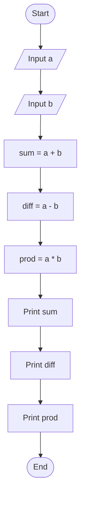
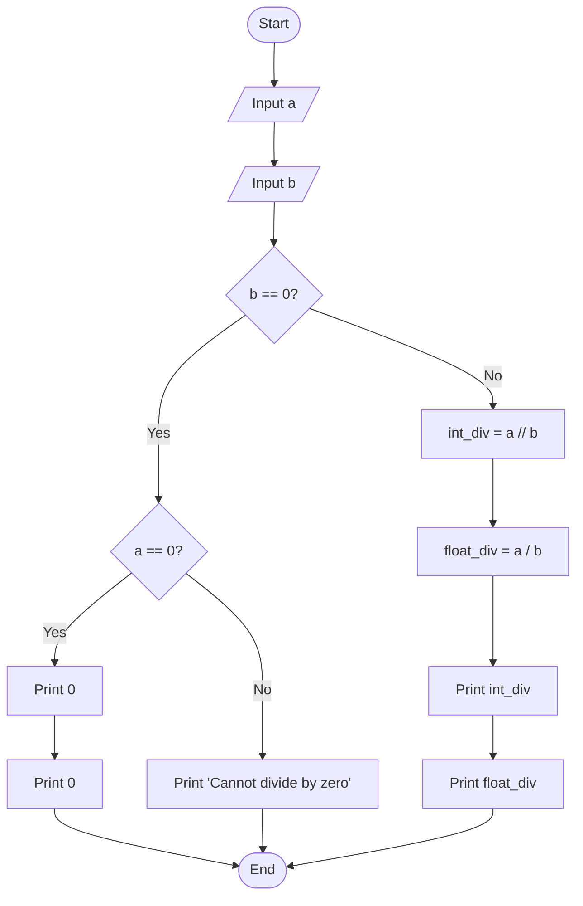
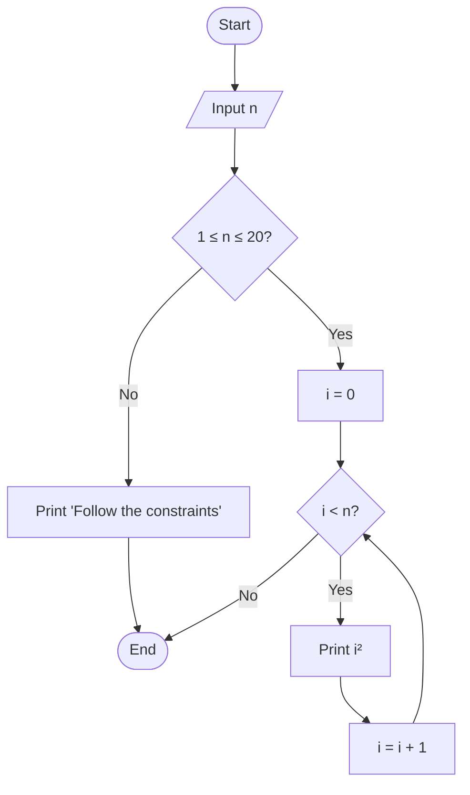
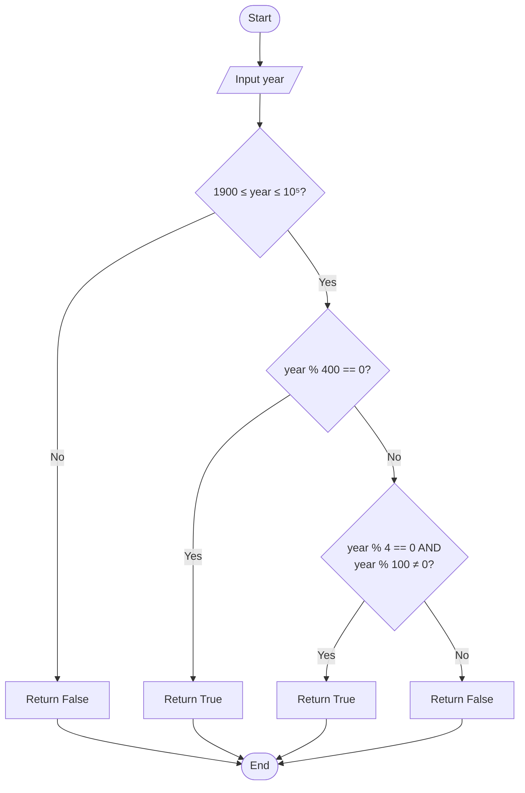
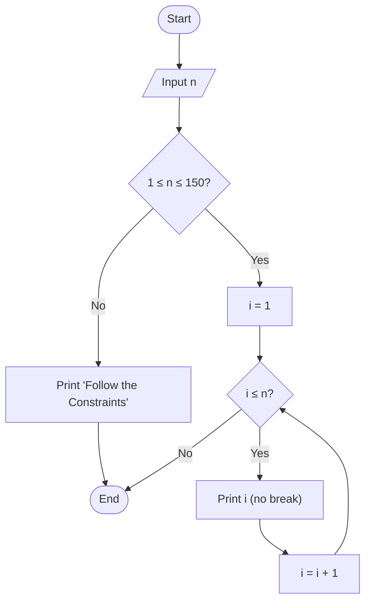
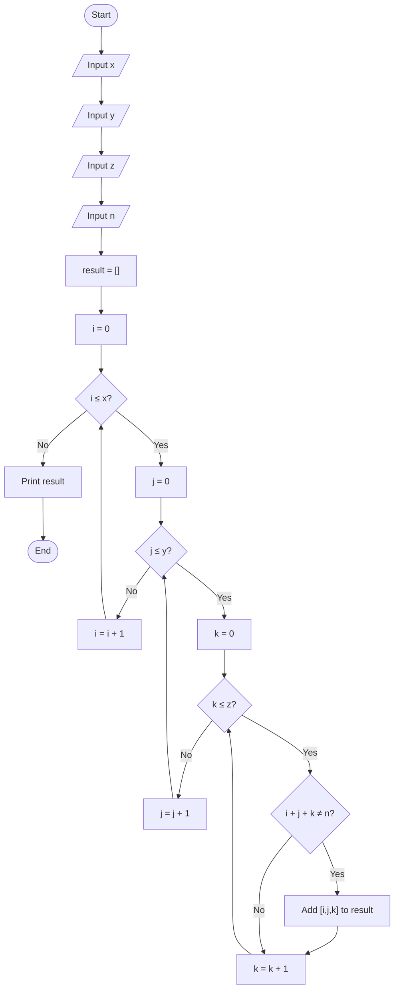

# Problem Statement 1: Print "Hello, World!"

## Problem Idea
Print the exact string `"Hello, World!"` to the output.

---

## Explanation
This is a simple introductory problem that requires printing a predefined string. The program has no input and no logic—just a direct output statement.

---

## Step-by-Step Algorithm
1. Start.
2. Print the string `"Hello, World!"`.
3. End.

---

## Flowchart


---

## Time and Space Complexity
- Time Complexity: `O(1)`
- Space Complexity: `O(1)`

---

# Problem Statement 2
# Weird or Not Weird - Explanation and Algorithm

## Problem Idea
Given an integer `n`, print:
- `Weird` if `n` is odd.
- `Not Weird` if `n` is even and in the range 2 to 5.
- `Weird` if `n` is even and in the range 6 to 20.
- `Not Weird` if `n` is even and greater than 20.

Also, if input is not in the valid range 1 to 100, print:
`Please enter a number between 1 and 100.`

---

## Explanation
The program first checks whether the input value is valid (between 1 and 100).

- If invalid, it immediately prints the warning message.
- If valid, it checks number properties in order:
	1. Odd number -> `Weird`
	2. Even and 2 to 5 -> `Not Weird`
	3. Even and 6 to 20 -> `Weird`
	4. Even and above 20 -> `Not Weird`

This order is important because only one condition should be matched and printed.

---

## Step-by-Step Algorithm
1. Start.
2. Read integer `n`.
3. If `n < 1` or `n > 100`, print the range warning and stop.
4. Else, if `n` is odd (`n % 2 == 1`), print `Weird`.
5. Else, if `n` is between 2 and 5 (inclusive), print `Not Weird`.
6. Else, if `n` is between 6 and 20 (inclusive), print `Weird`.
7. Else (so `n > 20`), print `Not Weird`.
8. End.

---

## Flowchart

```mermaid
flowchart TD
		A([Start]) --> B[/Input n/]
		B --> C{n < 1 or n > 100?}

		C -- Yes --> D[Print: "Please enter a number between 1 and 100."]
		D --> Z([End])

		C -- No --> E{n % 2 == 1?}
		E -- Yes --> F[Print: "Weird"]
		F --> Z

		E -- No --> G{2 <= n <= 5?}
		G -- Yes --> H[Print: "Not Weird"]
		H --> Z

		G -- No --> I{6 <= n <= 20?}
		I -- Yes --> J[Print: "Weird"]
		J --> Z

		I -- No --> K[Print: "Not Weird"]
		K --> Z
```

---

## Time and Space Complexity
- Time Complexity: `O(1)` (constant checks)
- Space Complexity: `O(1)`

---

# Problem Statement 3: Arithmetic Operations

## Problem Idea
Given two integers `a` and `b`, print:
1. The sum of `a + b`
2. The difference `a - b`
3. The product `a * b`

---

## Explanation
The program reads two integers and performs three basic arithmetic operations on them. Each result is printed on a separate line in order: sum, difference, then product.

---

## Step-by-Step Algorithm
1. Start.
2. Read integer `a`.
3. Read integer `b`.
4. Compute and print `a + b`.
5. Compute and print `a - b`.
6. Compute and print `a * b`.
7. End.

---

## Flowchart



---

## Time and Space Complexity
- Time Complexity: `O(1)` (three arithmetic operations)
- Space Complexity: `O(1)`

---

# Problem Statement 4: Integer and Float Division

## Problem Idea
Given two integers `a` and `b`, print:
1. Integer division result: `a // b`
2. Float division result: `a / b`

Handle the edge case where `b = 0`.

---

## Explanation
The program performs two types of division:
- **Integer division** (`a // b`): Divides and discards the decimal part.
- **Float division** (`a / b`): Divides and returns the decimal result.

Division by zero is handled with error checking. If `b = 0` and `a ≠ 0`, print an error. If both are 0, print two 0s.

---

## Step-by-Step Algorithm
1. Start.
2. Read integer `a`.
3. Read integer `b`.
4. If `b = 0`:
   - If `a ≠ 0`: print "Cannot divide by zero".
   - Else (both are 0): print 0 and 0.
5. Else (b ≠ 0):
   - Compute and print integer division `a // b`.
   - Compute and print float division `a / b`.
6. End.

---

## Flowchart



---

## Time and Space Complexity
- Time Complexity: `O(1)` (division operations)
- Space Complexity: `O(1)`

---

# Problem Statement 5: Print Squares of Numbers

## Problem Idea
Given an integer `n`, print the squares of all integers from 0 to n-1: `0², 1², 2², ..., (n-1)²`.

Constraint: `1 ≤ n ≤ 20`

---

## Explanation
The program uses a loop to iterate from 0 to n-1. For each iteration, it computes and prints the square of the current number. Input validation ensures `n` is within bounds.

---

## Step-by-Step Algorithm
1. Start.
2. Read integer `n`.
3. If `n < 1` or `n > 20`, print "Follow the constraints" and stop.
4. Else, initialize loop variable `i = 0`.
5. While `i < n`:
   - Compute and print `i²` (i.e., `i * i`).
   - Increment `i` by 1.
6. End.

---

## Flowchart



---

## Time and Space Complexity
- Time Complexity: `O(n)` (loop runs n times)
- Space Complexity: `O(1)`

---

# Problem Statement 6: Leap Year Checker

## Problem Idea
Determine if a given year is a leap year based on the Gregorian calendar rules:
- Divisible by 400 → Leap year
- Divisible by 100 (but not 400) → Not a leap year
- Divisible by 4 (but not 100) → Leap year
- Otherwise → Not a leap year

Constraint: `1900 ≤ year ≤ 10⁵`

---

## Explanation
A leap year is determined by three conditions checked in priority order:
1. If divisible by 400, it's a leap year.
2. If divisible by 100 (but not 400), it's **not** a leap year.
3. If divisible by 4 (but not 100), it's a leap year.
4. Otherwise, it's not a leap year.

The function returns `True` or `False`.

---

## Step-by-Step Algorithm
1. Start.
2. Read year.
3. If year is outside range [1900, 10⁵], return `False`.
4. Else, check leap year conditions:
   - If `year % 400 == 0`, return `True`.
   - Else if `year % 4 == 0` and `year % 100 ≠ 0`, return `True`.
   - Else, return `False`.
5. End.

---

## Flowchart



---

## Time and Space Complexity
- Time Complexity: `O(1)` (constant modulo operations)
- Space Complexity: `O(1)`

---

# Problem Statement 7: Print Consecutive Numbers

## Problem Idea
Given an integer `n`, print all integers from 1 to n **without spaces or line breaks** (as a single concatenated line).

Example: For n=3, output: `123`

Constraint: `1 ≤ n ≤ 150`

---

## Explanation
The program uses a loop to iterate from 1 to n and prints each number with `end=""` to prevent automatic line breaks. This concatenates all numbers into a single line. Input validation checks the constraint range.

---

## Step-by-Step Algorithm
1. Start.
2. Read integer `n`.
3. If `n < 1` or `n > 150`, print "Follow the Constraints" and stop.
4. Else, loop from `i = 1` to `i = n`:
   - Print `i` without a line break (using `end=""`).
5. End.

---

## Flowchart



---

## Time and Space Complexity
- Time Complexity: `O(n)` (loop runs n times)
- Space Complexity: `O(1)`

---

# Problem Statement 8: 3D Coordinates

## Problem Idea
Given four integers `x`, `y`, `z`, and `n`, print all possible coordinates `(i, j, k)` where:
- `0 ≤ i ≤ x`
- `0 ≤ j ≤ y`
- `0 ≤ k ≤ z`
- `i + j + k ≠ n`

The output is a list of lists where each coordinate is excluded if its sum equals `n`.

---

## Explanation
The program generates all possible triples in a 3D grid using **list comprehension** with three nested loops. It filters out coordinates where the sum `i + j + k` equals `n`. The result is a list of lists (2D array format).

---

## Step-by-Step Algorithm
1. Start.
2. Read integers `x`, `y`, `z`, and `n`.
3. Create a list comprehension:
   - Loop through all `i` from 0 to `x`.
   - For each `i`, loop through all `j` from 0 to `y`.
   - For each `(i, j)`, loop through all `k` from 0 to `z`.
   - Add `[i, j, k]` to the list if `i + j + k ≠ n`.
4. Print the list.
5. End.

---

## Flowchart



---

## Time and Space Complexity
- Time Complexity: `O(x * y * z)` (three nested loops)
- Space Complexity: `O(x * y * z)` (for the output list)

